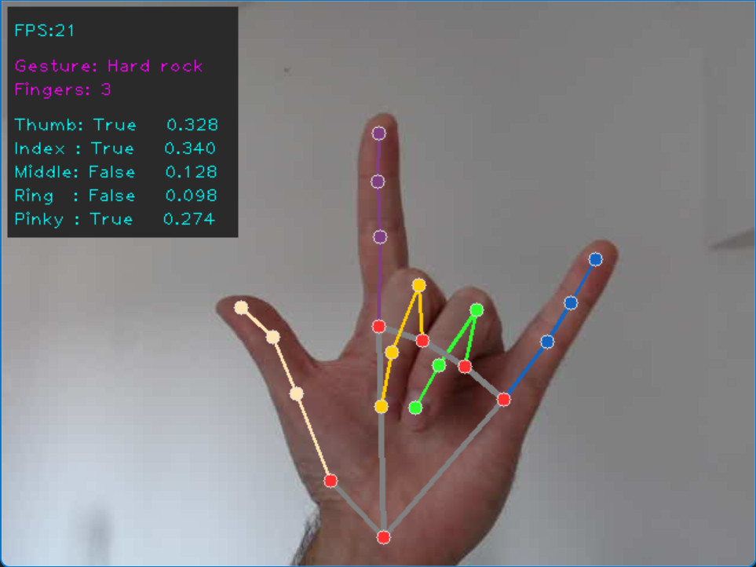

# Finger counter & gesture detector demo

Simple hand/finger/gesture detector demo using OpenCV and MediaPipe.




# Dependencies

[OpenCV](https://docs.opencv.org/)
```
pip install opencv-python
```

[Media Pipe](https://google.github.io/mediapipe/solutions/hands#python-solution-api)
```
pip install mediapipe
```


# Run

To run the app, execute `HandDetector.py` or call `HandDetector.main()`.


# Controls

Press <kbd>Esc</kbd> to exit the app.


# Camera

To use different camera, change camera device index number in `HandDetector.main()`
```python
cameraDeviceIndex = 0
```


# TODO

`HandSolver`

Finger length is absolute. i.e. the closer the hand is to the camera, the bigger the number (finger length) is.
